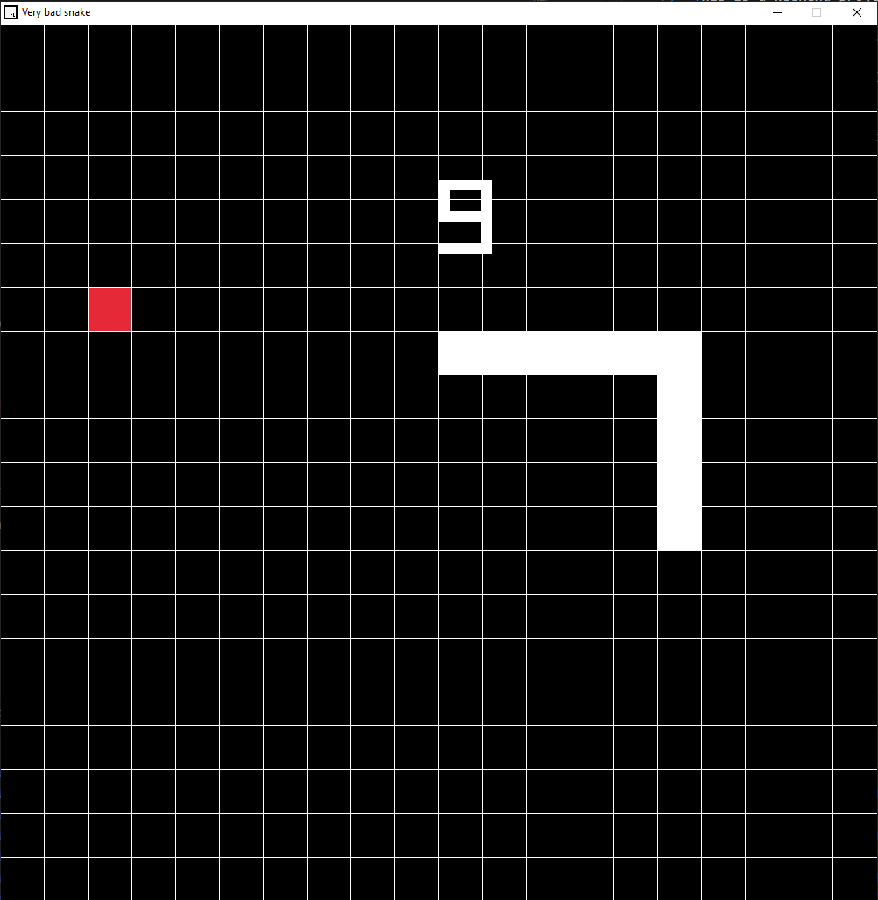

# Raylib Snake

This is my implementation of the classic game snake.
This is a weekend project, learning how to use C++ and make a game using raylib.

## Requirements

- Raylib 4.5 or Higher

## Build

- To build the game, just download the repo, open on VSCode, and press F5.

## To Play

- W,A,S,D to move the snake.
- Eat red tiles to grow.
- Don't run into your own snake body.

## Templated Used: Raylib-CPP-Starter-Template-for-VSCODE-V2

I am using the Raylib C++ Starter Template for Visual Studio Code on Windows, which allows
the use of Raylib with C++ classes and .cpp files.

[Link Here](https://github.com/educ8s/Raylib-CPP-Starter-Template-for-VSCODE-V2)
